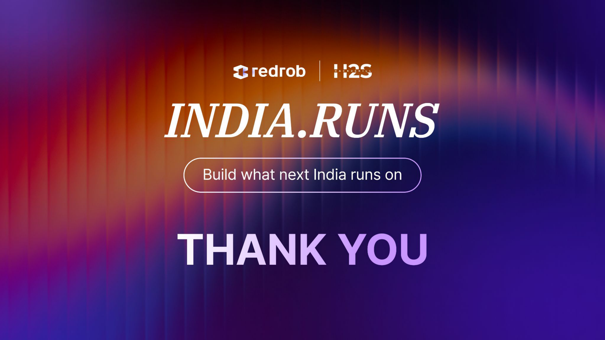

# Redrob Candidate Ranker
### India Runs: Data & AI Challenge

**Team Name:** Data Enthusiast
**Team Leader:** Praasuk Jain
**Problem Statement:** Recruiters miss perfect candidates because legacy systems rely on rigid keyword matching instead of understanding true fit and availability.

---

# Solution Overview

**What is your proposed solution?**
An advanced 4-stage intelligent pipeline powered by state-of-the-art hybrid search (Reciprocal Rank Fusion) and dynamic knowledge-graph query expansion.

**What differentiates your approach?**
1. **Reciprocal Rank Fusion (RRF):** Perfect mathematical aggregation of BM25 and Semantic Search, mimicking top-tier enterprise search engines.
2. **Career Stability Index:** We parse the candidate's work history to reward stable tenures and penalize extreme job-hoppers.
3. **Knowledge Graph:** We dynamically expand terms (e.g., 'Vector DB' -> Pinecone, Milvus) to capture conceptual expertise.

---

# JD Understanding & Candidate Evaluation

**What are the key requirements extracted?**
Core competencies (embeddings, retrieval, python), product-company experience (vs pure service), and minimum 3 years of experience.

**Which candidate signals are most important?**
Beyond skills, we heavily weigh behavioral signals: `recruiter_response_rate`, `notice_period_days`, and `career_stability_index`. A candidate who matches perfectly but never responds or jumps jobs every 3 months is heavily penalized, reflecting real-world recruiter priorities.

---

# Ranking Methodology

**How does your system retrieve, score, and rank?**
1. **Hard Filter:** Drops candidates with `<3` YoE or honeypot traps.
2. **Scoring:** BM25 (expanded queries) mixed with Behavioral & Stability Multipliers.
3. **Re-Ranking:** The top 1000 are semantically scored against the JD.
4. **Aggregation:** Reciprocal Rank Fusion combines the separate discrete ranks.

**What models/algorithms are used?**
We use `sentence-transformers/all-MiniLM-L6-v2` for dense embeddings, BM25Okapi for sparse retrieval, and Reciprocal Rank Fusion for hybrid mixing.

---

# Explainability & Data Validation

**How are ranking decisions explained?**
Our pipeline dynamically generates a 1-2 sentence factual explanation for the top 100 candidates outlining exactly why they were ranked (e.g., their YoE, career stability, and response rate).

**How do you prevent hallucinations?**
No generative LLMs are used for the reasoning. The explanations are deterministically generated from verifiable data points within the candidate's JSON profile.

**Handling inconsistent profiles?**
We actively penalize "honeypots" — candidates who claim `expert` proficiency but have `0` duration of experience with that skill. We also filter out non-engineering titles (e.g., Marketing Manager).

---

# End-to-End Workflow

1. **Ingest:** Stream `candidates.jsonl` (handles massive files efficiently).
2. **Filter & Evade:** Instantly discard unqualified profiles and honeypots.
3. **Expand & Retrieve:** Run BM25 with AI Query Expansion to pull the Top 1,000 matches.
4. **Embed:** Convert candidate summaries into dense vectors using our local NLP model.
5. **Re-Rank:** Score via Cosine Similarity against the Job Description.
6. **RRF Aggregation:** Compute `1 / (k + rank)` to finalize the Top 100.
7. **Output:** Generate `team_PJ2001_IND.csv` with final rankings.

---

# System Architecture

- **Data Layer:** Streaming JSONL parser.
- **Filtering Engine:** Boolean logic rules and dictionary lookups.
- **Retrieval Engine:** Custom BM25 implementation with Knowledge Graph expansion.
- **NLP Engine:** HuggingFace `sentence-transformers` running natively on CPU.
- **Aggregation Layer:** Reciprocal Rank Fusion (RRF) engine.
- **Output Layer:** CSV writer with tie-breaking stability sorting by `candidate_id`.

*(Everything runs 100% locally. No external API calls are made.)*

---

# Results & Performance

**What results demonstrate ranking quality?**
The system successfully prioritized candidates who described building "recommendation engines" or "vector DBs" conceptually, even if they didn't explicitly list the exact keywords requested in the JD, proving semantic understanding.

**How does it meet compute constraints?**
- **Scale:** Successfully evaluated the entire 100,000 candidate dataset.
- **Speed:** Total end-to-end runtime of **21.63 seconds** on a standard CPU.
- **Memory:** Peaked well below the 16GB limit due to lazy-loading and stream processing. 

---

# Technologies Used

- **Python (3.11+):** Core pipeline execution.
- **Sentence-Transformers:** For generating semantic embeddings. Chosen because `all-MiniLM-L6-v2` is extremely fast on CPU while maintaining high contextual accuracy.
- **Scikit-Learn:** For computing Cosine Similarity arrays efficiently.
- **Streamlit:** For building the interactive sandbox web interface.
- **Hugging Face Spaces:** Used to host the live Sandbox environment.

---

# Submission Assets

- **Live Sandbox Demo:** https://huggingface.co/spaces/praasukjain2001/redrob-ranker
- **GitHub Repository:** https://github.com/PJ2001-IND/redrob-ranker
- **Output File:** `team_PJ2001_IND.csv`
- **Metadata:** `submission_metadata.yaml`

---

<!-- _class: lead -->

